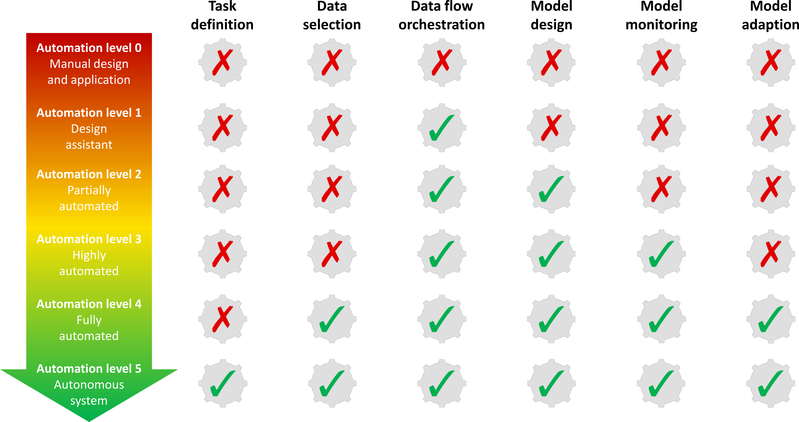
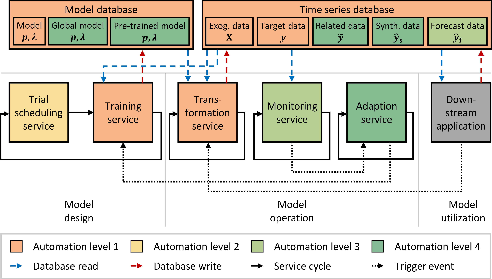

<!----AutoLVL---->
<!----_Automation level taxonomy for time series forecasting services_---->

# Why should you consider automation for time series forecasting? 🤔
Automating the design and operation of forecasting models is essential to meet the growing demand for localized forecasts.
Although many automation methods exist, a clear guideline for creating new forecasting services is lacking.
AutoLVL fills this gap by offering a simple taxonomy for defining requirements, choosing methods, and clarifying the extent of automation achieved.
In particular, AutoLVL defines six automation levels, inspired by the SAE standard for autonomous driving.

_____________________

# How is AutoLVL supporting architecture design of forecasting services? 🙌
First, it's crucial to identify the requirements for the forecast's application.
For example, the forecast might need to handle missing or limited training data (cold-start problem) and automatically adapt to changes during operation.
Once the requirements are identified, the forecasting model can be selected, and the architecture of the forecasting service can be designed.
Since the taxonomy applies to all time series forecasting tasks, a generic service architecture can be created to handle different forecasting models.

_____________________

# Who contributed? 🤝

[Stefan Meisenbacher](https://github.com/smeisen)1,2,
Johannes Galenzowski1,2,
Kevin Förderer1,
Wolfgang Suess1,
[Simon Waczowicz](https://www.iai.kit.edu/Ansprechpersonen_2620.php)1,
[Ralf Mikut](https://www.iai.kit.edu/Ansprechpersonen_1030.php)1,
[Veit Hagenmeyer](https://www.iai.kit.edu/Ansprechpersonen_1213.php)1,

1_Karlsruhe Institute of Technology, Karlsruhe, Germany_;
2_equal contribution_

This project is funded by the Helmholtz Association under the Program Energy System Design and the Helmholtz Association’s Initiative and Networking Fund through Helmholtz AI as well as ’Smart East’ (funding reference L7521113).
The DCP was a cooperative effort of the partners Seven2one, InnoCharge GmbH, FZI Research Center for Information Technology, BES Badische Energie-Servicegesellschaft mbH and Stadtwerke Karlsruhe GmbH.
We also thank all associated partners for their support, and the Institute for Automation and Applied Informatics for the provision of algorithms and IT infrastructure.
_____________________

# Where else should you have a look at? 🔎
Source Code (_Coming Soon!_)

[Paper on automated PV forecasting (AutoPV)](https://dl.acm.org/doi/10.1145/3575813.3597348)

[Paper on automated electrical load forecasting (PNN)](https://dl.acm.org/doi/10.1145/3396851.3397683)

[Source Code of AutoPV](https://github.com/SMEISEN/AutoPV)

[Source Code of PNN](https://github.com/benHeid/Profile-Neural-Network)

Our Test Environment: The [Energy Lab](https://www.elab.kit.edu/) at the [Karlsruhe Institute of Technology](https://www.kit.edu/english/index.php)

Some other cool [projects](https://github.com/KIT-IAI) from the [Institute for Automation and Applied Informatics](https://www.iai.kit.edu/english/index.php)

[Python](https://www.python.org/)

[Docker](https://www.docker.com/) 

[Kubernetes](https://kubernetes.io/)

_____________________
